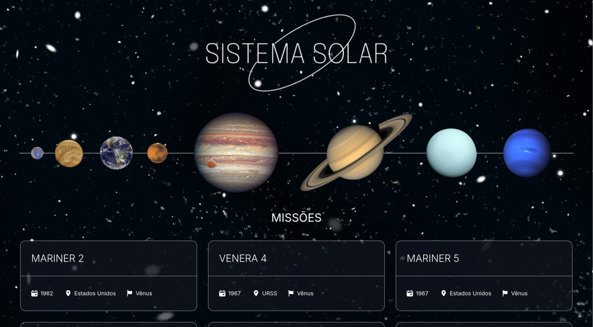

# Project Solar System

## Link

## [solar-system.vercel](https://paulo-solar-system.vercel.app/)

## Preview

## About

This is my 14th project during my journey at Trybe!

**Solar System** is a simple and responsive web page that displays all NASA missions with a clean and pleasant design.
The main goal of this project was to introduce **React**, which adds componentization to the code, and **TypeScript**, which brings strong typing to **JavaScript** for better reliability and maintainability

## Repository Structure

- The `src` folder contains all the code

## Technologies Used

### REACT

  - The application uses [REACT](https://react.dev/) is a JavaScript library it allows developers to create reusable UI components and efficiently update the user interface when data changes. React is maintained by Meta and a community of individual developers and companies

---

### TypeScript

  - [TypeScript](https://www.typescriptlang.org/) is a strongly typed superset of JavaScript that compiles to plain JavaScript. It helps developers catch errors early through static type checking and makes code more predictable, readable, and easier to maintain

---
